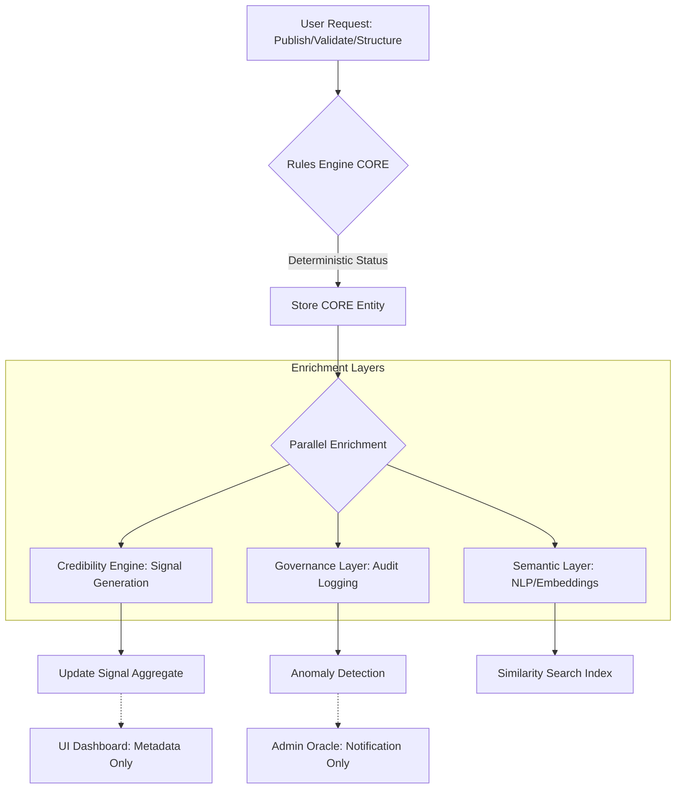

# Work Proof OS — CANONICAL DECISION FLOW v1

## 📝 FLOW CHARACTERISTICS
1. **Unidirectional Decision**: Reaching step (C) is enough for the user journey.
2. **Post-Process Enrichment**: (E, F, G) happen asynchronously or as a follow-up, never blocking (B).
3. **No Closed-Loop Decision**: Enrichment signals (H, I, J) NEVER flow back into (B) during runtime.

---
*Status: ARCHITECTURE FREEZE v1*
